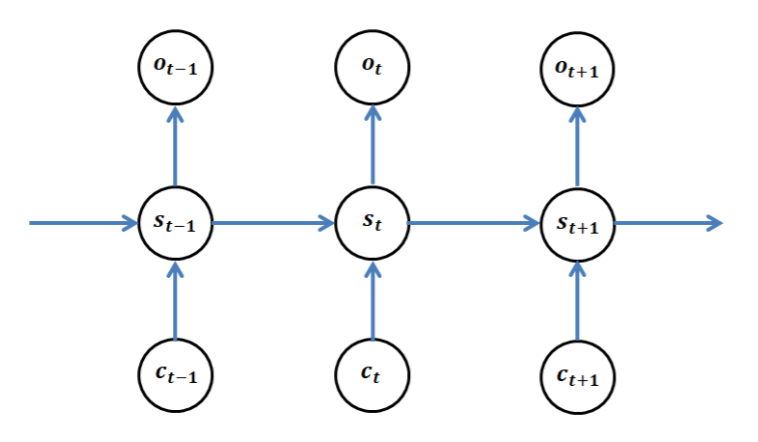

# Deep State-Space Models in Multi-Agent Systems
Code implementation of deep state-space models (SSM) in multi-agent-systems (MAS) as proposed by [Indarjo's master thesis](https://www.universiteitleiden.nl/binaries/content/assets/science/mi/scripties/master/2018-2019/master-thesis-fin---pararawendy.pdf) (2019)

Outline:
1. Explain about the method, incl. how to use the method
2. Method with covariance structure
3. method implementation (explain the toy problem), note: modif toy problem in phase 2 (ground truth of 2nd agent)

## Problem assumptions
We consider multi-agent systems (MAS) that consist of a controllable agent and some other agents (can be either collaborators or opponents, or both) which interact with each other. The general assumptions on the systems are as follows:
- Observation in each time step, denoted by  is a noisy non-linear mapping from a true environment state , which is unobserved (latent).
- The true environment state  evolves over time and gets affected also by both controllable agent's action , and other agents' actions .
- Other agents' actions  also come from a noisy non-linear mapping of another true latent state representation .
- The true latent state representation  also evolves over time and gets affected by the environment state , which can be seen as the *summary* of all current observation and previous actions (both controllable agent's and other agents').

We propose a formulation of deep state-space models (DSSMs) over the considered systems. There are two main goals of this formulation. First is to model the environment dynamics. That is, the change on the environment as a result of all actions taken by the involved agents in the systems. Secondly, to predict the other agents' actions to be taken utilizing some results from the first modelling phase.

## The models
The key idea of the models is to perform two phases of DSSMs, each for modelling one of the two goals mentioned above. There are three sequences available (observed) in this problem: the observations , our controllable agent's actions  and other agents' actions . For convenience, we will denote the concatenation of the two agents' actions as .

Phase 1 of the models is devoted to model the sequence observations, conditioned on all actions in place (our controllable agent's and the other agents'). The main goal is to perform inference on the sequence of environment states  from the observations , which is also affected by both agents' actions . As environment states, we can think of   as a sequence of summaries that contains all the information of the system in a more compact way.  After we have  at hand, we go to Phase 2 of the models, namely to model the sequence of other agents' actions , conditioned by the system summaries .

### Phase 1
In this phase, the goal is originally to fit a generative model for the sequence of observations conditioned on the sequence of all actions in place, i.e. ). We achieve this goal by incorporating self-introduced latent variables (here they are known as the environment states) . The joint distribution (or equivalently the generative model) in this phase is

Along with this, we subsequently introduce a variational distribution ) to approximate the true (but intractable) posterior ). We define the factorization of this variational distribution as follows

Therefore, the objective function we want to optimize (maximize) in Phase 1 is the following ELBO (Evidence Lower BOund) of ), which is the simplification of the following expression

We assume all unobserved latent variables are multivariate Gaussian distributions, while the distribution of the observation depends on the data specification. It can be modelled as Gaussian (real-valued), binary, or categorical distribution. Concluding this construction, an example of graphical form of the generative model in this phase is given in the following.

We parameterize each distribution ,  and  by neural networks, such that ,  and  are the parameters of neural networks ,  and  respectively. These neural networks are called *emission net, transition net*, and *inference net*, respectively. Note that, with parameterization by neural networks we mean that the neural networks emit the parameters of the distribution, e.g. the mean and variance values (hence the output layer consists of two blocks in this case) for Gaussian distribution.

Since we parameterize all the distributions using neural networks, ELBO maximization is now carried out through jointly tune all the neural networks parameters ,  and . We train all the neural networks using backpropagation algorithm.

The Bayesian net of Phase 1 is given below.

